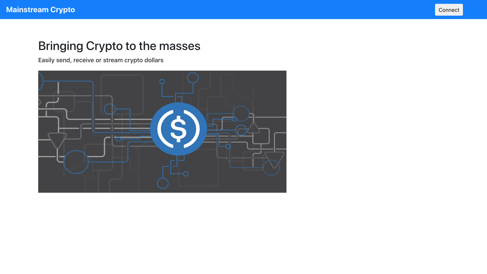
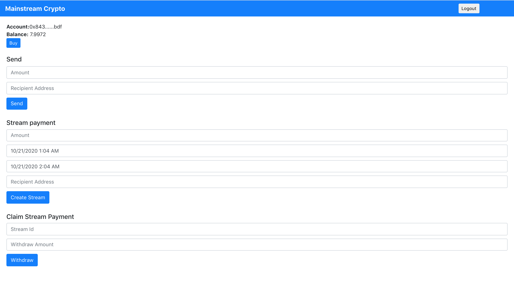

# Mainstream Crypto
Easily send, receive or stream crypto dollars (USDC) using Mainstream Crypto. Sending or receiving USDC does not require 
ether since it uses meta transactions powered by Biconomy. It uses transferWithAuthorization for sending USDC and permit for stream token approval. 
USDC stream is powered using Sablier.

## App Link
https://mainstreamcrypto.netlify.app/ (Ropsten Network) 

## Screenshots





## Getting Started

1) Clone the repo

   ```
   git clone https://github.com/viraja1/mainstream_crypto.git 
   ```
   
2) Change Directory

   ```
   cd mainstream_crypto
   ```

3) Install packages
   ```
   npm install
   ```

4) Register the app on the Biconomy Dashboard and whitelist USDC methods 
   for meta transactions (transferWithAuthorization and permit). 
   Then update the biconomyAPIKey, transferWithAuthorizationApiId and permitApiId in src/App.js

   https://dashboard.biconomy.io/
    
5) Start the app

   ```
   npm start 
   ```
   
6) Test the app

   ```
   http://localhost:3000/
   ```